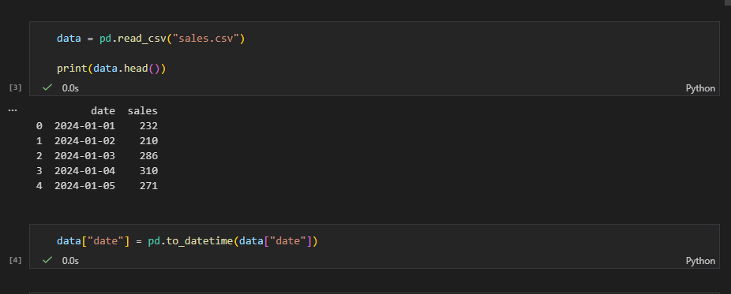
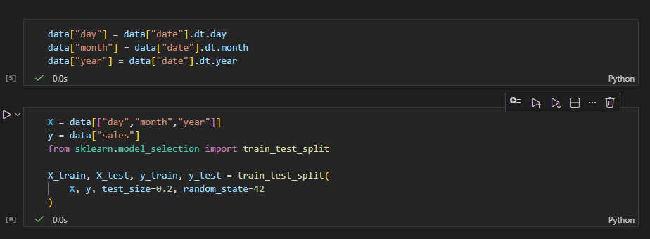
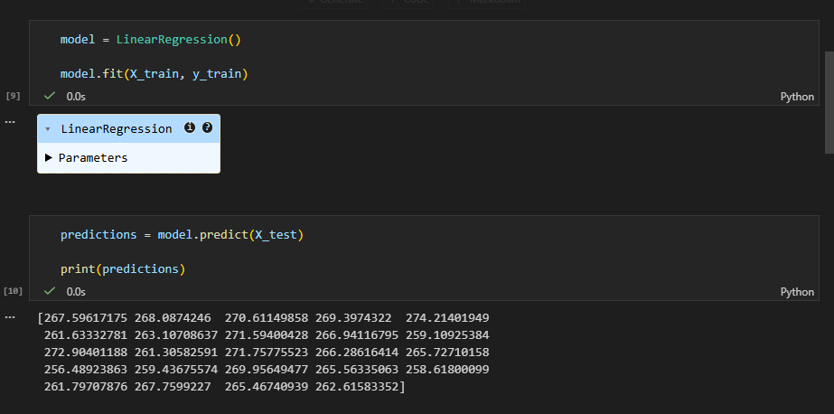
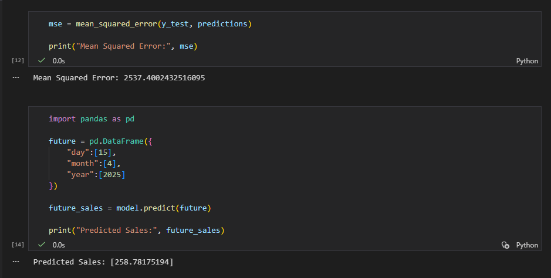
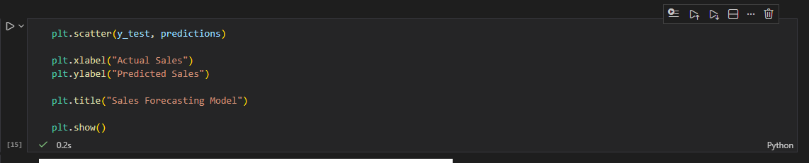
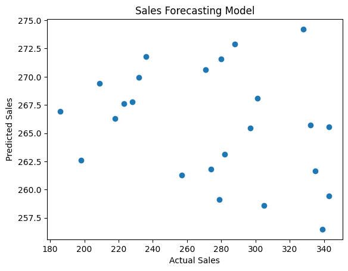

# Sales & Demand Forecasting for Businesses

## Project Overview

This project builds a **Machine Learning model to forecast future sales using historical business data**.
Sales forecasting helps businesses make informed decisions about **inventory management, production planning, and marketing strategies**.

Using historical sales records, the model learns patterns and predicts future sales values.

---

## Objectives

* Analyze historical sales data
* Perform time-based feature engineering
* Train a machine learning model to forecast sales
* Evaluate the model performance
* Visualize predicted vs actual sales trends

---

## Technologies Used

* Python
* Pandas
* Scikit-learn
* Matplotlib

---

## Dataset

The dataset contains **historical daily sales data** with the following columns:

| Column | Description                  |
| ------ | ---------------------------- |
| date   | Date of the sales record     |
| sales  | Number of sales on that date |

## Project Workflow

### 1. Data Loading

The dataset is loaded using **Pandas**.

### 2. Data Preprocessing

The date column is converted into datetime format.

### 3. Feature Engineering

New time-based features are extracted:

* Day
* Month
* Year

These features help the model understand temporal patterns.

### 4. Model Training

A **Linear Regression model** is trained using the extracted time features to predict sales.

### 5. Model Evaluation

The model performance is evaluated using **Mean Squared Error (MSE)**.

### 6. Sales Prediction

The trained model predicts future sales for a given date.

### 7. Visualization

Actual sales values are compared with predicted values using a scatter plot.

---

## Results & Insights

The model successfully learned the trend in historical sales data and was able to generate reasonable predictions.

Sales forecasting systems like this can help businesses:

* Plan inventory levels
* Anticipate customer demand
* Improve supply chain management
* Make better strategic decisions

---

## Screenshots

### Dataset Preview

### Feature Engineering

### Model Training and Prediction

### Sales Prediction

### Forecast Visualization

---

## Conclusion

This project demonstrates how **Machine Learning can be applied to business forecasting problems**.
By analyzing historical sales patterns, the model can predict future demand and assist businesses in making data-driven decisions.
